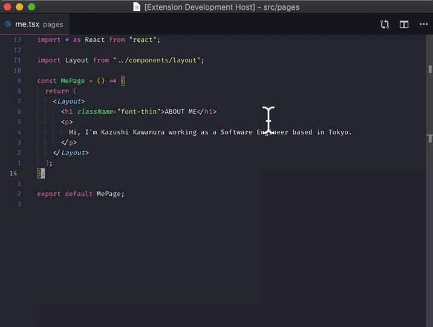

# vscode-grep README

## Features

Incremental grep extension for Visual Studio Code.

## Git Grep (grep.git)



## Extension Settings

| Setting            | Description                                         | Type    | Default Value |
| ------------------ | --------------------------------------------------- | ------- | ------------- |
| `grep.git.preview` | Enable / Disable preview when the item is selected. | boolean | false         |

## Commands

```json
"commands": [
  {
    "command": "grep.git",
    "title": "Grep: Git"
  }
]
```

## Project Roadmap

- [x] git grep
- [x] git grep - preview mode
- [ ] git grep - regex

## Release Notes

### 0.1.0

Initial Release for prototype.
